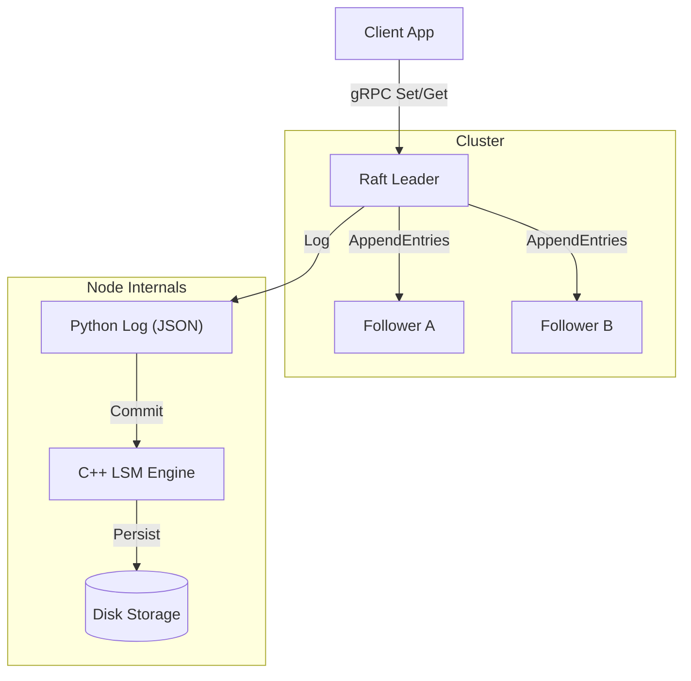

# FlashKV: Distributed Key-Value Cluster

A high-performance, strongly consistent distributed Key-Value store.
FlashKV combines a **C++17 Log-Structured Merge (LSM)** storage engine with a **Python implementation of the Raft Consensus Algorithm**. It features automatic leader election, log replication, and snapshot persistence to guarantee data durability during network partitions.


## Features

### Distributed Consensus (Raft)
- **Leader Election:** Automatic failover after 2s and in <300ms using randomised election timeouts.
- **Log Replication:** Strong consistency via Leader-only writes and backtracking log repair.
- **Cluster Management:** Dynamic heartbeat suppression to prevent "split-brain" term inflation.
- **Persistence:** JSON-based Log persistence to survive total node amnesia (and prevent leader backtracking to repopulate node data).

### High-Performance Storage Engine
- **C++17 Core:** Custom LSM architecture using `std::unordered_map` and Append-Only Logs.
- **Performance:** **1.58M read ops/sec** (106x faster than SQLite for lookups, single node performance).
- **Durability:** Atomic garbage collection (compaction, loads map then saves, very easy) and binary-safe serialisation.

### Network Architecture
- **gRPC & Protobuf:** Strict type-safe RPCs for inter-node communication.
- **Failure Handling:** Client redirection by follower nodes hinting who leader is to enforce linearisability, worst case 2 hops to find leader.

## Architecture



## Performance (Single Node)

Benchmarks run on 100,000 operations against `sqlite3` and Python `dict`.


| Database | Write Ops/Sec | Read Ops/Sec |
| :--- | :--- | :--- |
| **FlashKV (Engine)** | **122,159** | **1,587,296** |
| SQLite | 613,113 | 14,930 |
| Python Dict | 3,124,947 | 4,761,925 |

## Installation
```bash
# Download the repository first, run this in the root of that directory:
pip install .
```

## Quick Start (Cluster)

You can spin up a 3-node cluster locally like this:

```bash
# Terminal 1 (Leader Candidate)
python -m cluster.node --id 1 --port 5000 --peers 5001,5002

# Terminal 2
python -m cluster.node --id 2 --port 5001 --peers 5000,5002

# Terminal 3
python -m cluster.node --id 3 --port 5002 --peers 5000,5001
```

### Run the Demo Client
This script connects to the cluster, finds the leader, and writes data. If you kill the leader, it automatically fails over.

```bash
python tools/demo_client.py
```

## Usage (Low-Level Engine)
To use the C++ engine directly (without Raft):

```python
import flashkv

db = flashkv.Database("data.db")
db.set("user:101", "Jane Doe")
print(db.get("user:101"))
db.compact() # Reclaim disk space
```
